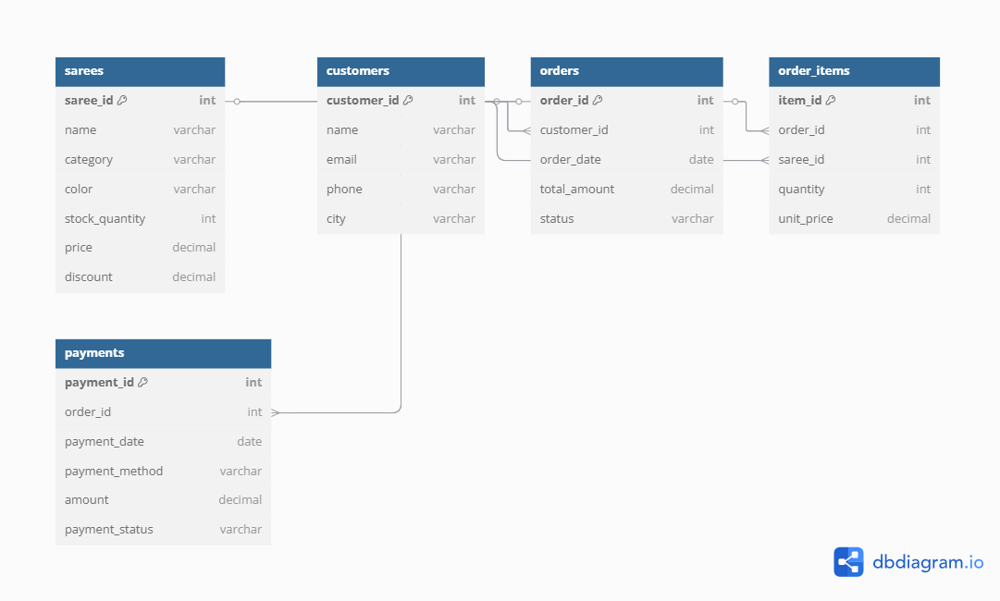

# 🧵 Saree Store Management System (SQL Project)

This project is a **MySQL-based inventory and sales tracking system** designed for a saree store. It helps manage sarees, customers, orders, and payments, and provides useful reports for business insights.

---

## 📂 Project Structure

schema.sql          -- 💾 Contains all table creation (CREATE TABLE) statements
insert_data.sql     -- 🧪 Adds sample sarees, customers, orders, and payments (INSERT INTO)
queries.sql         -- 📊 Useful reports like top-selling sarees, pending orders, monthly revenue
README.md           -- 📘 Project overview and documentation
er_diagram.png      -- 🗺 Visual ER Diagram showing table relationships

---

## 🧱 Database Tables

- **sarees** – Product catalog with stock and pricing
- **customers** – Customer information
- **orders** – Orders placed by customers
- **order_items** – Items within each order
- **payments** – Payment details per order

---

## 📊 Sample Queries

- Top-selling sarees by quantity
- Total revenue per customer
- Sarees with low stock
- Monthly sales report
- Orders with failed payments

---

## 🚀 Features

- Track saree stock, sales, and orders
- Manage customer database
- Analyze business performance
- Identify low-stock or failed payment issues

---

## 🛠 Tech Stack

- MySQL
- GitHub for version control

---

## 🗺 ER Diagram

---

## 📌 How to Use

1. Import the `saree_store_management.sql` file into MySQL Workbench or any SQL client.
2. Run the script to create tables and insert sample data.
3. Use the provided queries or write your own to explore the database.

---

## 💡 Future Enhancements

- Build a web or mobile app frontend
- Add billing and invoice generation
- Integrate product images and categories
- Add user login and admin panel

---

## 🙌 Made with love by Thiyaneshwaran R
